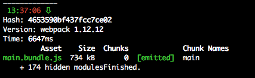

# webpack-watch-time-plugin
Webpack plugin to display time when watcher rebuild happens

## Installation
`npm i -D 'webpack-watch-time-plugin'`

_In webpack.config.js_
```javascript
const WatchTimePlugin = require('webpack-watch-time-plugin');
let config = {
	// <...>

	plugins: [
		WatchTimePlugin,
	]
};

module.exports = config;
```

## Usage
`webpack -w`


